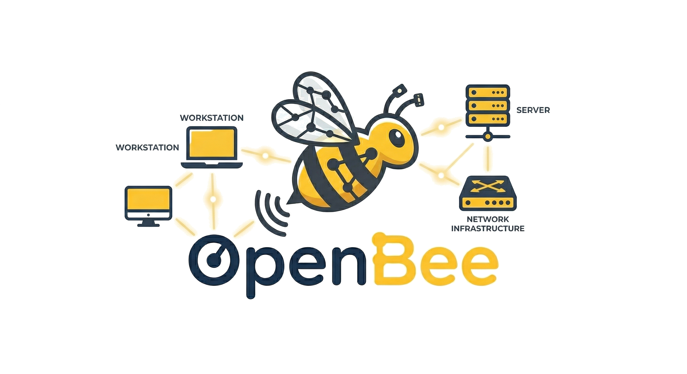
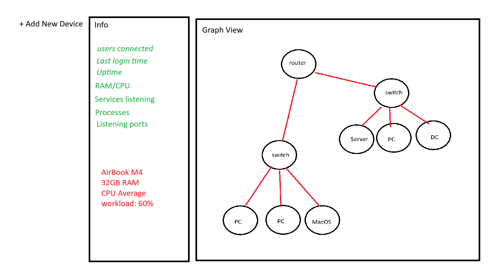

<p align="center">
  
</p>

<p align="center">
  <em>"Buzz Buzz! Let the bees do the hard work for you."</em><br/><br/>
  <strong>AI-Powered Network Management & Discovery</strong>
</p>

<p align="center">
  <a href="#getting-started">Getting Started</a> •
  <a href="#how-it-works">How It Works</a> •
  <a href="#ai-console">AI Console</a> •
  <a href="#examples">Examples</a> •
  <a href="#supported-platforms">Platforms</a>
</p>

---

## 🍯 The Hive Philosophy

In a beehive, the Queen doesn't carry pollen. She doesn't build honeycomb. **The bees do all the heavy lifting.**

OpenBee works the same way. **You are the Queen.** Your network is the hive. And the bees, our AI-powered agents, will discover, manage, and configure every device in your infrastructure. You just tell them what you need.

No more clicking through UIs from the year 2000. No more memorizing PowerShell cmdlets. No more SSH-ing into 15 machines to check one thing.

**Just say your words, my Queen. The bees will handle it.**

---

## 📸 The Hive at a Glance

<p align="center">
  
</p>

*Your entire network, visualized as a hive. Managed devices glow. Unmanaged devices are discovered automatically. Double-click any managed device to open the AI Console.*

---

## 🚀 Getting Started

Getting started with OpenBee is as simple as adding your first device:

1. **Click "Add Device"** in the top bar
2. **Choose the OS type** — Windows, Linux, or macOS
3. **Pick the protocol** — WinRM or SSH
4. **Enter the IP and credentials**
5. **Watch the bees work** — the scanner connects, runs discovery commands, and maps the device live

That's it. The device appears in your hive graph, and OpenBee automatically discovers every other device it can see — gateways, DNS servers, DHCP servers, ARP neighbors — all added to the graph as unmanaged devices. Toggle them on or off with the "Unmanaged" switch.

**To manage any device, just double-click it on the graph.** You're instantly in a prompt screen where you can query and act. That's the entire workflow. Click and talk.

---

## 🔍 How It Works

### Discovery — The Scout Bees

When you add a device, OpenBee deploys **scout bees** that map the device and everything around it. The bees gather:

🔹 **Network interfaces** — IPs, MACs, subnet masks, connection status
🔹 **ARP neighbors** — every device visible on the local network
🔹 **Routing tables** — default gateways and network routes
🔹 **DNS & DHCP servers** — who's serving names and addresses
🔹 **System information** — OS, hostname, hardware, domain, memory
🔹 **Running services** — every listening port and the process behind it
🔹 **NetBIOS names** — machine identities on Windows networks

From this data, OpenBee builds your hive:

**Managed devices** (devices you scanned) are shown prominently. **Gateways** are detected from routing tables and shown as routers. **DNS & DHCP servers** are detected from network config. **ARP neighbors**, every device seen on the wire, appear as unmanaged nodes.

### AI Console — The Worker Bees

Once a device is in the hive, the AI Console is your command center. The worker bees can:

**Run remote commands** on the device via SSH or WinRM. **Fetch files** from the device for local analysis. **Execute Python scripts in an isolated environment on the Hive Mind** for parsing binary files, crunching data, or processing logs. **Chain actions** across multiple iterations — fetch a file, parse it, run more commands, and synthesize a final answer.

The AI maintains **conversation history per device**, so it remembers what you discussed earlier. Ask a follow-up and it knows the context.

### Cross-Device Intelligence — The Hive Mind

The Hive Mind is the central brain of OpenBee. It is where the server code resides, where all API requests are processed, and where remote connection sessions to your devices are established. It is the most crucial asset in the hive.

The Hive Mind maintains a **global context** of your entire network. It understands the relationships between devices — which machine is the router, which is the DNS server, which is the domain controller. This enables **complex multi-device operations from a single prompt**. When a Python script needs to run for parsing files or crunching data, it executes in an isolated environment on the Hive Mind, keeping your managed devices untouched.

---

## 💬 Examples

### Example 1: Set Up a Web Server from Scratch

You want to deploy a web app. IIS on the server, repo from GitHub, and open it to the internet.

**You (on WEB-SRV-01):**
> Set up IIS, clone https://github.com/acme/webapp, and open it to the internet.

**🐝 OpenBee:**
```
$ Install-WindowsFeature -Name Web-Server -IncludeManagementTools
[output] Success: True, Restart Needed: No

$ git clone https://github.com/acme/webapp C:\inetpub\wwwroot\webapp
[output] Cloning into 'C:\inetpub\wwwroot\webapp'... done.

$ New-IISSite -Name "WebApp" -PhysicalPath "C:\inetpub\wwwroot\webapp" -BindingInformation "*:80:"
[output] Site "WebApp" created successfully.

🧠 Thinking... WEB-SRV-01 is behind gateway-10.0.0.1 (Cisco ASA 5506-X).
   To open it to the internet I need to configure port forwarding on the
   router. Activating the Cisco bee... 🐝

$ ssh admin@10.0.0.1 "show running-config | include interface"
[output] interface GigabitEthernet0/0 (outside)
         interface GigabitEthernet0/1 (inside)

$ ssh admin@10.0.0.1 "object network WEB-SRV-01"
$ ssh admin@10.0.0.1 "host 10.0.0.50"
$ ssh admin@10.0.0.1 "nat (inside,outside) static interface service tcp 80 80"
[output] Configuration applied.

✓ All done! IIS is installed, the repo is cloned, and the site is live.
  I also configured port forwarding on your Cisco ASA 5506-X router.
  External port 80 → 10.0.0.50:80 (WEB-SRV-01).
  Your web app is now accessible from the internet.
```

---

### Example 2: Managing Active Directory

**You (on DC-01):**
> Create a Group Policy that installs Google Chrome silently on all domain computers.

**🐝 OpenBee:**
```
$ New-GPO -Name "Install Google Chrome" | New-GPLink -Target "DC=acme,DC=local"
[output] GPO "Install Google Chrome" created and linked to acme.local

$ Invoke-WebRequest -Uri "https://dl.google.com/dl/chrome/install/googlechromestandaloneenterprise64.msi" -OutFile "\\DC-01\NETLOGON\ChromeSetup.msi"
[output] Download complete.

$ Set-GPRegistryValue -Name "Install Google Chrome" -Key "HKLM\SOFTWARE\Policies\Microsoft\Windows\Installer" ...
[output] Software installation policy configured.

✓ Group Policy "Install Google Chrome" is created and linked to the domain.
  Chrome MSI is staged on NETLOGON. All domain computers will install Chrome
  at next Group Policy refresh (or run gpupdate /force to push now).
```

**You:**
> Add a new domain user called John Dubian and add him to the HR group.

**🐝 OpenBee:**
```
$ New-ADUser -Name "John Dubian" -SamAccountName "jdubian" -UserPrincipalName "jdubian@acme.local" -Path "OU=Users,DC=acme,DC=local" -AccountPassword (ConvertTo-SecureString "W3lc0me!2026" -AsPlainText -Force) -Enabled $true
[output] User "John Dubian" created successfully.

$ Add-ADGroupMember -Identity "HR" -Members "jdubian"
[output] User "jdubian" added to group "HR".

✓ Done! User John Dubian (jdubian@acme.local) has been created and added to
  the HR group. Temporary password: W3lc0me!2026 (user will be prompted to
  change on first login).
```

---

### Example 3: Who Logged In via RDP?

**You:**
> Who logged on recently using RDP to FILE-SRV-02?

**🐝 OpenBee:**
```
$ fetch: C:\Windows\System32\winevt\Logs\Microsoft-Windows-TerminalServices-LocalSessionManager%4Operational.evtx
[output] Fetched → C:\Users\...\AppData\Local\Temp\discovery_rdp.evtx (2.4 MB)

$ python (local)
[output] Parsed 847 events. Found 12 RDP logon events in the last 7 days.

✓ Here are the recent RDP logons to FILE-SRV-02:

  | Date                | User              | Source IP      |
  |---------------------|-------------------|----------------|
  | 2026-03-28 14:22:01 | ACME\jsmith       | 10.0.0.105     |
  | 2026-03-28 09:15:44 | ACME\jdubian      | 10.0.0.112     |
  | 2026-03-27 18:30:12 | ACME\admin         | 10.0.0.1       |
  | 2026-03-27 11:05:33 | ACME\jsmith       | 10.0.0.105     |
  | 2026-03-26 16:48:00 | ACME\mwilliams    | 10.0.0.88      |

  The most frequent RDP user is jsmith (4 sessions this week).
  Last RDP login was by jsmith from 10.0.0.105, today at 2:22 PM.
```

The AI fetched the Windows Event Log binary file, ran a Python script in an isolated environment on the Hive Mind to parse the .evtx format, and presented the results, all from a single prompt.

---

### Example 4: Network-Wide Queries

**You:**
> Which devices in the hive are running SSH on a non-standard port?

**🐝 OpenBee:**
```
✓ I've checked all managed devices in the hive. Here are the ones with SSH
  on non-standard ports:

  | Device         | IP          | SSH Port |
  |----------------|-------------|----------|
  | DEV-SRV-03     | 10.0.1.15   | 2222     |
  | BACKUP-01      | 10.0.2.30   | 8022     |

  All other devices with SSH are on the standard port 22.
```

---

## 🖥️ Supported Platforms

OpenBee works with **any Windows or Unix-like machine**. If it has a network interface, OpenBee can discover it. If it supports SSH or WinRM, OpenBee can manage it.

| Platform | Discovery | Management | Protocol |
|----------|-----------|------------|----------|
| Windows Server | ✅ | ✅ | WinRM |
| Windows 10/11 | ✅ | ✅ | WinRM |
| Ubuntu / Debian | ✅ | ✅ | SSH |
| RHEL / CentOS | ✅ | ✅ | SSH |
| macOS | ✅ | ✅ | SSH |
| Routers / Switches | ✅ | ✅ | SSH |
| Any network device | ✅ (passive) | — | ARP discovery |

**The sky is the limit.** If you can SSH or WinRM into it, OpenBee can manage it.

---

## 🔮 Coming Soon

🔌 **More Protocols** — support for RDP, Telnet, and WMI connections

🌐 **Web API Management** — connect to devices that only offer management through web interfaces (routers, switches, firewalls, appliances)

📦 **Agent Installation from Web Console** — install the OpenBee agent directly from the UI onto any machine

🐝 **Custom Bee Agent** — a lightweight agent for non-standard machines and devices behind strict firewalls (backconnect mode — the bee calls home to the Hive Mind instead of the other way around)

🔄 **Continuous Monitoring** — bees that keep watching for changes in your hive

⏰ **Automation** — schedule recurring tasks to run on any device at set intervals (e.g. clean temp files every night, pull latest code every hour, restart a service weekly)

---

## 🐝 Adding Devices to the Hive

There are two ways to bring devices into the hive:

### Option 1: Credentials + Protocol (Current)
Click **Add Device**, enter the IP, username, password, and select WinRM or SSH. OpenBee connects immediately and scans.

### Option 2: Agent Installation (Coming Soon)
From the web console, generate an agent installer. Run it on the target machine. The agent registers itself with the hive automatically — no credentials needed.

---

## 🏗️ Architecture

```
                    🐝 The Hive
                         │
              ┌──────────┼──────────┐
              │          │          │
         ┌────┴────┐ ┌───┴───┐ ┌───┴────┐
         │ Worker  │ │Worker │ │ Worker │
         │ Bee     │ │ Bee   │ │  Bee   │
         │ (SSH)   │ │(WinRM)│ │ (SSH)  │
         └────┬────┘ └───┬───┘ └───┬────┘
              │          │         │
         ┌────┴────┐ ┌───┴───┐ ┌──┴─────┐
         │ Linux   │ │Windows│ │ Router │
         │ Server  │ │  DC   │ │        │
         └─────────┘ └───────┘ └────────┘

    Queen (You) ──prompt──▶ AI Brain ──commands──▶ Worker Bees
                                │
                         ┌──────┤
                         │      │
                    fetch files  run local
                    from hive   python scripts
```

---

## ⚠️ Disclaimer

**OpenBee is provided "as is", without warranty of any kind.** The authors and contributors are **not responsible** for any damage, data loss, security incidents, or any other harm resulting from the use or misuse of this software.

**AI-powered operations can be dangerous.** OpenBee executes real commands on real machines. AI agents may make mistakes, misinterpret instructions, or take unexpected actions. **Human supervision is required at all times**, especially when operating on critical systems, production environments, or sensitive assets.

By using OpenBee, you acknowledge that:
- You are solely responsible for any actions taken by the software on your systems.
- AI-generated commands should be reviewed before execution on production/critical infrastructure.
- The authors bear no liability for any consequences arising from the use of this tool.

**Use responsibly. Always have backups. Always supervise.**

---

## 📄 License

MIT — Free as honey. 🍯

---

<p align="center">
  <strong>🐝 OpenBee</strong><br/>
  <em>Your Network. Your Bees. Their Job.</em><br/><br/>
  Stop doing IT. Let the bees do it for you.
</p>
